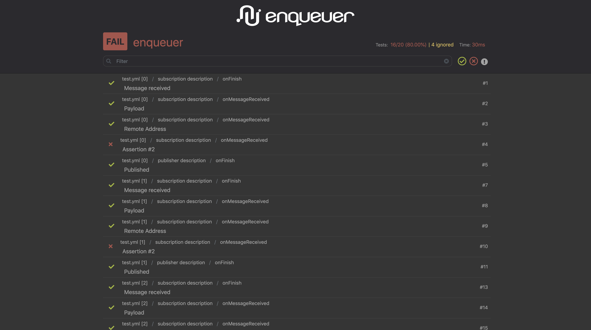

# enqueuer-plugin-html-report

Enqueuer plugin to enable good looking html-reports

#### Screenshot

#### Installation
    $ npm install enqueuer enqueuer-plugin-html-report
    
#### Usage
Create a [config file](conf.yml) specifying this reporter and other options.
Then run `enqueuer` using this configuration file.

    $ nqr conf.yml -l enqueuer-plugin-html-report

#### Example
[Check it live](https://enqueuer-land.github.io/enqueuer-plugin-html-report/)
